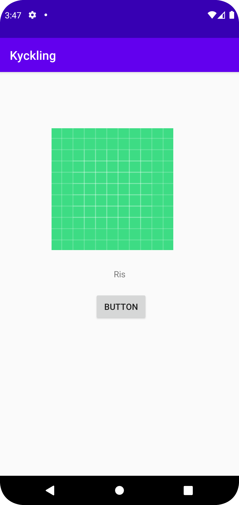

Först ändrades namnet på sidan till "kyckling" i string.xml, sedan lades button till
i MainActivity.java, sedan imageView även i MainActivity.java där det finns kod exempel
nedan på constraintsen kring imageView, sist skapades en textView med namnet ris.

```
    <ImageView
        android:id="@+id/imageView2"
        android:layout_width="245dp"
        android:layout_height="200dp"
        android:layout_marginStart="120dp"
        android:layout_marginLeft="120dp"
        android:layout_marginTop="158dp"
        android:layout_marginEnd="129dp"
        android:layout_marginRight="129dp"
        android:layout_marginBottom="389dp"
        app:layout_constraintBottom_toBottomOf="parent"
        app:layout_constraintEnd_toEndOf="parent"
        app:layout_constraintHorizontal_bias="0.569"
        app:layout_constraintStart_toStartOf="parent"
        app:layout_constraintTop_toTopOf="parent"
        app:layout_constraintVertical_bias="0.782"
        app:srcCompat="@drawable/ic_launcher_background" />
```
